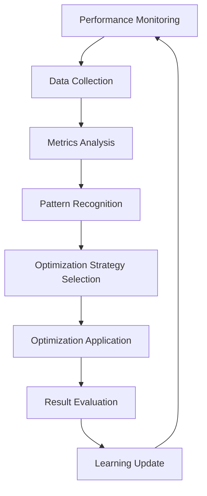

# PerformanceOptimizer - Adaptive Performance Tuning and Resource Optimization

## Overview

The PerformanceOptimizer is a sophisticated component of the AI Stability Architecture that provides **adaptive performance tuning** and **resource optimization** for AI components. It continuously monitors, learns from, and optimizes the performance of all AI components in the system, ensuring optimal efficiency and resource utilization.

## Core Features

### 🎯 Adaptive Performance Tuning
- **Real-time monitoring** of component performance metrics
- **Intelligent optimization strategies** based on performance patterns
- **Automatic parameter adjustment** for optimal performance
- **Learning from optimization results** to improve future decisions

### 🔧 Resource Optimization
- **CPU, memory, and GPU usage optimization**
- **Dynamic resource allocation** based on component needs
- **Resource efficiency analysis** and improvement recommendations
- **Bottleneck identification** and resolution

### 🧠 Intelligent Learning
- **Pattern recognition** from performance data
- **Predictive analytics** for performance trends
- **Anomaly detection** for unusual performance patterns
- **Adaptive rule generation** based on learned patterns

## Architecture Design

### Performance Monitoring Pipeline



### Optimization Strategy Framework

```typescript
interface OptimizationStrategy {
    name: string;
    description: string;
    applicableTiers: ComponentTier[];
    priority: number;
    
    canApply: (profile: PerformanceProfile) => boolean;
    apply: (component: AIComponent, profile: PerformanceProfile) => Promise<OptimizationResult>;
    rollback: (component: AIComponent, optimization: OptimizationResult) => Promise<void>;
}
```

## Key Components

### 1. Performance Monitoring
- **Real-time metrics collection** from all AI components
- **Historical performance tracking** with configurable retention
- **Trend analysis** for performance patterns
- **Anomaly detection** for unusual performance behavior

### 2. Optimization Engine
- **Multiple optimization strategies** for different scenarios
- **Intelligent strategy selection** based on component characteristics
- **Safe optimization application** with rollback capabilities
- **Performance impact measurement** and validation

### 3. Learning System
- **Pattern recognition** from performance data
- **Adaptive rule generation** based on learned patterns
- **Performance prediction** using historical data
- **Continuous improvement** through feedback loops

### 4. Resource Management
- **Resource usage monitoring** and optimization
- **Efficiency analysis** and improvement recommendations
- **Bottleneck identification** and resolution strategies
- **Dynamic resource allocation** optimization

## Optimization Strategies

### 1. Timeout Optimization
```typescript
// Adjusts component timeout based on performance patterns
{
    name: 'Timeout Optimization',
    applicableTiers: [STABLE, ADVANCED, EXPERIMENTAL],
    canApply: (profile) => profile.metrics.responseTime.average < component.timeout * 0.8,
    apply: async (component, profile) => {
        const optimalTimeout = profile.metrics.responseTime.average * 1.5;
        component.timeout = Math.max(optimalTimeout, 10);
        return optimizationResult;
    }
}
```

### 2. Memory Optimization
```typescript
// Optimizes memory allocation based on usage patterns
{
    name: 'Memory Optimization',
    applicableTiers: [ADVANCED, EXPERIMENTAL, RESEARCH],
    canApply: (profile) => profile.resources.memory.efficiency < 0.8,
    apply: async (component, profile) => {
        const optimalMemory = profile.resources.memory.usage * 1.2;
        component.memoryLimit = Math.max(optimalMemory, 256);
        return optimizationResult;
    }
}
```

### 3. Priority Optimization
```typescript
// Adjusts component priority based on performance metrics
{
    name: 'Priority Optimization',
    applicableTiers: [CRITICAL, STABLE, ADVANCED],
    canApply: (profile) => profile.metrics.reliability.current > 0.9,
    apply: async (component, profile) => {
        const performanceScore = calculatePerformanceScore(profile);
        component.priority = Math.min(component.priority + performanceScore * 10, 100);
        return optimizationResult;
    }
}
```

### 4. Configuration Optimization
```typescript
// Optimizes component configuration parameters
{
    name: 'Configuration Optimization',
    applicableTiers: [STABLE, ADVANCED, EXPERIMENTAL],
    canApply: (profile) => profile.optimization.lastOptimized < Date.now() - 300000,
    apply: async (component, profile) => {
        const optimizedConfig = optimizeConfiguration(component.config, profile);
        component.config = optimizedConfig;
        return optimizationResult;
    }
}
```

## Performance Metrics

### Response Time Analysis
```typescript
interface ResponseTimeMetrics {
    current: number;        // Current response time
    average: number;        // Average over window
    p95: number;           // 95th percentile
    p99: number;           // 99th percentile
    trend: number;         // Trend indicator (-1 to 1)
}
```

### Throughput Analysis
```typescript
interface ThroughputMetrics {
    current: number;        // Current throughput
    average: number;        // Average throughput
    peak: number;          // Peak throughput
    trend: number;         // Trend indicator
}
```

### Resource Utilization
```typescript
interface ResourceMetrics {
    cpu: { usage: number; efficiency: number };
    memory: { usage: number; efficiency: number };
    gpu: { usage: number; efficiency: number };
}
```

## Configuration

### Basic Configuration
```typescript
const config: PerformanceOptimizerConfig = {
    monitoring: {
        enabled: true,
        interval: 5000,          // Monitoring interval in ms
        windowSize: 100,         // Number of samples to keep
        dataRetention: 86400000  // 24 hours
    },
    optimization: {
        enabled: true,
        aggressiveness: 0.5,     // 0.0 to 1.0
        learningRate: 0.1,       // Learning rate
        adaptationThreshold: 0.8, // Threshold for adaptation
        rollbackEnabled: true    // Enable rollback on failure
    },
    analytics: {
        enabled: true,
        predictiveAnalysis: true,
        patternRecognition: true,
        anomalyDetection: true
    }
};
```

### Performance Thresholds
```typescript
const thresholds = {
    responseTime: {
        excellent: 10,    // <10ms excellent
        good: 50,        // <50ms good
        acceptable: 200, // <200ms acceptable
        poor: 1000      // >1000ms poor
    },
    throughput: {
        minimum: 10,     // Minimum acceptable throughput
        target: 100,     // Target throughput
        maximum: 1000    // Maximum expected throughput
    },
    resourceUsage: {
        cpu: 80,         // 80% CPU threshold
        memory: 85,      // 85% memory threshold
        gpu: 90          // 90% GPU threshold
    }
};
```

## Usage Examples

### Basic Optimization
```typescript
// Initialize the performance optimizer
const performanceOptimizer = new PerformanceOptimizer(
    config,
    componentRegistry,
    resourceManager,
    healthMonitor
);

await performanceOptimizer.initialize();

// Optimize a component
const component = registry.getComponent('my_ai_component');
const request = createAIRequest();

const result = await performanceOptimizer.optimizePerformance(component, request);

console.log(`Optimization applied: ${result.applied}`);
console.log(`Strategy: ${result.optimization}`);
console.log(`Improvement: ${result.results?.improvement * 100}%`);
```

### Execute with Monitoring
```typescript
// Execute AI component with performance monitoring
const allocation = { cpu: 50, memory: 512, gpu: 20 };
const response = await performanceOptimizer.executeWithMonitoring(
    component,
    request,
    allocation
);

console.log(`Response time: ${response.executionTime}ms`);
console.log(`Optimized: ${response.optimized}`);
```

### Get Performance Analytics
```typescript
// Get performance snapshot
const snapshot = await performanceOptimizer.getPerformanceSnapshot();

console.log(`Average think time: ${snapshot.averageThinkTime}ms`);
console.log(`Optimization score: ${snapshot.optimizationScore * 100}%`);
console.log(`Adaptation rate: ${snapshot.adaptationRate}`);

// Get detailed analytics
const analytics = await performanceOptimizer.getPerformanceAnalytics();

console.log('System Performance:');
console.log(`  Total throughput: ${analytics.system.totalThroughput}`);
console.log(`  Resource efficiency: ${analytics.system.resourceEfficiency * 100}%`);

console.log('Recommendations:');
analytics.recommendations.forEach(rec => {
    console.log(`  ${rec.component}: ${rec.optimization}`);
    console.log(`    Expected improvement: ${rec.expectedImprovement * 100}%`);
});
```

## Advanced Features

### Adaptive Learning
```typescript
// The system learns from optimization results
interface AdaptationRule {
    condition: (profile: PerformanceProfile) => boolean;
    action: (component: AIComponent, profile: PerformanceProfile) => Promise<OptimizationResult>;
    confidence: number;
    priority: number;
}

// Example adaptation rule
const responseTimeAdaptation: AdaptationRule = {
    condition: (profile) => profile.metrics.responseTime.trend > 0.2,
    action: async (component, profile) => {
        return await applyTimeoutOptimization(component, profile);
    },
    confidence: 0.8,
    priority: 9
};
```

### Pattern Recognition
```typescript
// Identify performance patterns
const patterns = await performanceOptimizer.identifyPatterns(componentName);

patterns.forEach(pattern => {
    console.log(`Pattern: ${pattern.type}`);
    console.log(`Confidence: ${pattern.confidence * 100}%`);
    console.log(`Impact: ${pattern.impact}`);
});
```

### Anomaly Detection
```typescript
// Detect performance anomalies
const anomalies = await performanceOptimizer.detectAnomalies(componentName);

anomalies.forEach(anomaly => {
    console.log(`Anomaly in ${anomaly.metric}: ${anomaly.value}`);
    console.log(`Expected range: ${anomaly.expectedRange}`);
    console.log(`Severity: ${anomaly.severity}`);
});
```

## Event Monitoring

### Performance Events
```typescript
// Monitor optimization events
performanceOptimizer.on('optimization_applied', (event) => {
    console.log(`Optimization applied to ${event.component}`);
    console.log(`Strategy: ${event.data.strategy}`);
    console.log(`Improvement: ${event.data.result.results?.improvement * 100}%`);
});

performanceOptimizer.on('adaptive_optimization', (event) => {
    console.log(`Adaptive optimization triggered for ${event.component}`);
    console.log(`Rule: ${event.data.rule}`);
});

performanceOptimizer.on('optimization_failed', (event) => {
    console.log(`Optimization failed for ${event.component}`);
    console.log(`Error: ${event.data.error}`);
});
```

### Health Monitoring
```typescript
// Monitor system health
const health = await performanceOptimizer.healthCheck();

console.log(`System health: ${health.score * 100}%`);
console.log(`Status: ${health.status}`);
console.log(`Response time: ${health.metrics?.responseTime}ms`);
```

## Integration with Other Systems

### ComponentRegistry Integration
```typescript
// Automatic profile initialization for new components
registry.on('component_registered', async (component) => {
    await performanceOptimizer.initializeComponentProfile(component);
});
```

### HealthMonitor Integration
```typescript
// React to health changes
healthMonitor.on('health_changed', async (event) => {
    const component = registry.getComponent(event.component);
    if (component) {
        await performanceOptimizer.updatePerformanceProfile(component);
    }
});
```

### ResourceManager Integration
```typescript
// Optimize resource allocation
const resourceUsage = await resourceManager.getCurrentResourceUsage();
const optimizations = await performanceOptimizer.optimizeResourceAllocation(resourceUsage);
```

## Best Practices

### 1. Configuration Tuning
- **Start with conservative settings** and gradually increase aggressiveness
- **Monitor optimization effectiveness** and adjust parameters accordingly
- **Use appropriate thresholds** for your specific use case
- **Enable rollback** for production environments

### 2. Performance Monitoring
- **Set appropriate monitoring intervals** based on system requirements
- **Balance data retention** with storage constraints
- **Monitor key metrics** that align with business objectives
- **Set up alerting** for performance degradation

### 3. Optimization Strategy
- **Test optimizations** in staging environments first
- **Monitor optimization results** and track improvements
- **Use gradual optimization** rather than aggressive changes
- **Implement proper rollback mechanisms** for failed optimizations

### 4. Learning and Adaptation
- **Allow sufficient learning time** before making major changes
- **Monitor learning effectiveness** and adjust learning rates
- **Validate learned patterns** before applying them broadly
- **Maintain learning data quality** through proper data collection

## Troubleshooting

### Common Issues

1. **High Optimization Overhead**
   - Reduce monitoring frequency
   - Decrease aggressiveness setting
   - Limit optimization strategies

2. **Ineffective Optimizations**
   - Check threshold configurations
   - Verify component metrics accuracy
   - Review optimization strategy selection

3. **Learning Convergence Issues**
   - Adjust learning rate
   - Increase data collection period
   - Verify pattern recognition accuracy

### Debug Information

```typescript
// Enable debug logging
const config = {
    ...baseConfig,
    debug: true,
    monitoring: {
        ...baseConfig.monitoring,
        debugMetrics: true
    }
};

// Get detailed performance profile
const profile = await performanceOptimizer.getComponentProfile(componentName);
console.log('Detailed profile:', JSON.stringify(profile, null, 2));

// Monitor all events
performanceOptimizer.on('*', (event) => {
    console.log('Event:', event.type, event.data);
});
```

## Future Enhancements

### Planned Features

1. **Distributed Optimization**: Support for optimizing across multiple instances
2. **Advanced ML Models**: Integration with machine learning models for better prediction
3. **Custom Optimization Strategies**: Support for user-defined optimization strategies
4. **Performance Forecasting**: Predictive performance analysis and capacity planning

### Research Areas

1. **Reinforcement Learning**: Apply RL techniques for optimization strategy selection
2. **Multi-objective Optimization**: Balance multiple performance objectives simultaneously
3. **Federated Learning**: Share optimization knowledge across distributed systems
4. **Quantum Computing**: Explore quantum algorithms for complex optimization problems

---

The PerformanceOptimizer represents a significant advancement in AI system optimization, providing intelligent, adaptive, and learning-based performance tuning that ensures optimal efficiency and resource utilization across all AI components in the stability architecture. 