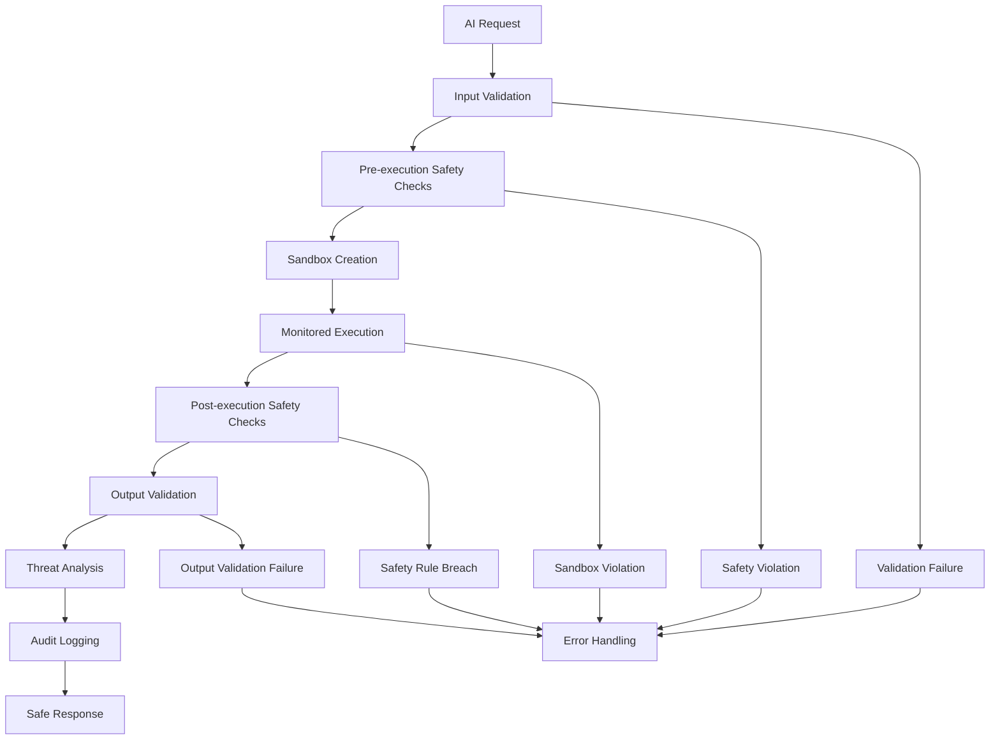

# SafetySystem - Validation, Sandboxing, and Safety Checks

## Overview

The SafetySystem is a critical component of the AI Stability Architecture that provides **comprehensive validation**, **secure sandboxing**, and **advanced safety checks** for all AI operations. It ensures that every AI component executes safely, securely, and within defined constraints, protecting the system from malicious behavior, errors, and security vulnerabilities.

## Core Features

### 🔍 Comprehensive Validation
- **Input validation** with schema checking and constraint enforcement
- **Output validation** with decision verification and bounds checking
- **Schema validation** for structured data integrity
- **Strict mode validation** for enhanced security requirements

### 🔒 Secure Sandboxing
- **Isolation levels** from basic to paranoid security
- **Resource limiting** for CPU, memory, and GPU usage
- **Operation monitoring** with allowed/blocked operation lists
- **Execution timeout enforcement** with automatic termination

### 🛡️ Advanced Safety Checks
- **Safety rule engine** with customizable rule definitions
- **Real-time monitoring** of component behavior
- **Violation detection** with severity classification
- **Enforcement mechanisms** (warn, block, terminate)

### 🕵️ Threat Detection
- **Behavior analysis** for anomalous patterns
- **Pattern recognition** for known threat signatures
- **Real-time monitoring** for suspicious activities
- **Threat assessment** with risk classification

## Architecture Design

### Safety Pipeline



### Multi-layer Security Model

```typescript
interface SecurityLayers {
    validation: 'Input/Output validation and schema checking';
    sandboxing: 'Isolated execution environment';
    safetyRules: 'Behavioral constraints and limits';
    threatDetection: 'Real-time threat monitoring';
    errorContainment: 'Failure isolation and recovery';
    auditLogging: 'Complete operation tracking';
}
```

## Key Components

### 1. Validation Engine
- **Input Validation**: Ensures all requests meet safety requirements
- **Output Validation**: Verifies response integrity and bounds
- **Schema Validation**: Enforces data structure constraints
- **Custom Validators**: Extensible validation rules

### 2. Sandboxing Engine
- **Isolation Levels**: Configurable security boundaries
- **Resource Monitoring**: Real-time resource usage tracking
- **Operation Control**: Allowed/blocked operation enforcement
- **Timeout Management**: Automatic execution termination

### 3. Safety Rule Engine
- **Rule Definition**: Declarative safety constraint definitions
- **Rule Enforcement**: Automatic violation detection and response
- **Custom Rules**: User-defined safety requirements
- **Rule Management**: Dynamic rule addition/modification

### 4. Threat Detection Engine
- **Behavior Analysis**: Pattern recognition for anomalous behavior
- **Real-time Monitoring**: Continuous threat assessment
- **Risk Classification**: Threat severity and impact analysis
- **Automated Response**: Proactive threat mitigation

## Safety Configuration

### Basic Configuration
```typescript
const safetyConfig: SafetySystemConfig = {
    validation: {
        enabled: true,
        strictMode: false,
        inputValidation: true,
        outputValidation: true,
        schemaValidation: true
    },
    sandboxing: {
        enabled: true,
        isolationLevel: 'strict',
        memoryLimit: 1024,
        timeLimit: 5000,
        resourceLimits: {
            cpu: 80,
            memory: 1024,
            gpu: 90
        }
    },
    safetyRules: {
        enabled: true,
        maxExecutionTime: 3000,
        maxMemoryUsage: 1024,
        maxRecursionDepth: 100,
        maxLoopIterations: 10000,
        allowedOperations: ['board_analysis', 'move_calculation'],
        blockedOperations: ['file_system_access', 'network_access']
    },
    threatDetection: {
        enabled: true,
        anomalyThreshold: 0.8,
        behaviorAnalysis: true,
        patternRecognition: true,
        realTimeMonitoring: true
    }
};
```

### Isolation Levels
```typescript
enum IsolationLevel {
    NONE = 'none',           // No isolation
    BASIC = 'basic',         // Basic resource monitoring
    STRICT = 'strict',       // Full resource and operation control
    PARANOID = 'paranoid'    // Maximum security restrictions
}
```

## Usage Examples

### Basic Safe Execution
```typescript
// Initialize the safety system
const safetySystem = new SafetySystem(
    config,
    componentRegistry,
    resourceManager,
    healthMonitor
);

// Execute AI component safely
const component = registry.getComponent('my_ai_component');
const request = createSafeAIRequest();

const response = await safetySystem.validateAndExecute(component, request);

console.log(`Safe execution completed:`);
console.log(`  Validated: ${response.validated}`);
console.log(`  Sandboxed: ${response.sandboxed}`);
console.log(`  Safety score: ${response.safetyScore}`);
```

### Input Validation
```typescript
// Validate AI request
const request: AIRequest = {
    type: 'move',
    board: gameBoard,
    player: 1,
    timeLimit: 1000,
    difficulty: 5
};

const validationResult = await safetySystem.validateInput(request);

if (!validationResult.valid) {
    console.error(`Validation failed: ${validationResult.reason}`);
    console.log('Details:', validationResult.details);
}
```

### Output Validation
```typescript
// Validate AI response
const response: AIResponse = {
    decision: {
        move: 3,
        confidence: 0.8,
        reasoning: 'Strategic center move'
    },
    executionTime: 150
};

const validationResult = await safetySystem.validateOutput(response);

if (!validationResult.valid) {
    console.error(`Output validation failed: ${validationResult.reason}`);
}
```

### Custom Safety Rules
```typescript
// Define custom safety rule
const customRule: SafetyRule = {
    id: 'confidence_threshold',
    name: 'Confidence Threshold',
    description: 'Ensures AI decisions have minimum confidence',
    severity: 'medium',
    enabled: true,
    validator: async (component, request, response) => {
        if (response && response.decision.confidence < 0.5) {
            return {
                type: 'low_confidence',
                severity: 'medium',
                component: component.name,
                message: `Low confidence: ${response.decision.confidence}`,
                timestamp: Date.now()
            };
        }
        return null;
    },
    enforcement: 'warn'
};

// Add custom rule
await safetySystem.addSafetyRule(customRule);
```

## Safety Rules

### Built-in Safety Rules

#### 1. Execution Time Limit
```typescript
{
    id: 'execution_time_limit',
    name: 'Execution Time Limit',
    description: 'Ensures AI execution does not exceed time limits',
    severity: 'high',
    validator: async (component, request, response) => {
        if (response?.executionTime > maxExecutionTime) {
            return createViolation('execution_time_violation', 'high', component.name);
        }
        return null;
    },
    enforcement: 'block'
}
```

#### 2. Memory Usage Limit
```typescript
{
    id: 'memory_usage_limit',
    name: 'Memory Usage Limit',
    description: 'Ensures AI does not exceed memory limits',
    severity: 'critical',
    validator: async (component, request, response) => {
        const memoryUsage = await getCurrentMemoryUsage(component);
        if (memoryUsage > maxMemoryUsage) {
            return createViolation('memory_violation', 'critical', component.name);
        }
        return null;
    },
    enforcement: 'terminate'
}
```

#### 3. Decision Validity
```typescript
{
    id: 'decision_validity',
    name: 'Decision Validity',
    description: 'Ensures AI decisions are valid and safe',
    severity: 'medium',
    validator: async (component, request, response) => {
        if (response && !isValidDecision(response.decision, request)) {
            return createViolation('invalid_decision', 'medium', component.name);
        }
        return null;
    },
    enforcement: 'block'
}
```

#### 4. Blocked Operations
```typescript
{
    id: 'blocked_operations',
    name: 'Blocked Operations',
    description: 'Prevents execution of blocked operations',
    severity: 'critical',
    validator: async (component, request, response) => {
        for (const blockedOp of blockedOperations) {
            if (await hasPerformedOperation(component, blockedOp)) {
                return createViolation('blocked_operation', 'critical', component.name);
            }
        }
        return null;
    },
    enforcement: 'terminate'
}
```

## Sandboxing

### Sandbox Environment
```typescript
interface SandboxEnvironment {
    id: string;
    isolated: boolean;
    memoryLimit: number;
    timeLimit: number;
    allowedOperations: Set<string>;
    blockedOperations: Set<string>;
    resourceMonitor: ResourceMonitor;
}
```

### Resource Monitoring
```typescript
interface ResourceMonitor {
    memoryUsage: number;
    cpuUsage: number;
    executionTime: number;
    operationCount: number;
    isWithinLimits: () => boolean;
}
```

### Sandbox Execution
```typescript
// Create and execute in sandbox
const sandbox = await safetySystem.createSandbox(component, request);

try {
    const response = await safetySystem.executeInSandbox(component, request, context);
    console.log('Sandbox execution successful');
} catch (error) {
    console.log('Sandbox violation:', error.message);
}
```

## Threat Detection

### Threat Analysis
```typescript
// Analyze component for threats
const threatAnalysis = await safetySystem.analyzeThreat(component, request, response);

console.log(`Threat level: ${threatAnalysis.threatLevel}`);
console.log(`Threats detected: ${threatAnalysis.threats.length}`);
console.log(`Action required: ${threatAnalysis.actionRequired}`);

if (threatAnalysis.recommendations.length > 0) {
    console.log('Recommendations:');
    threatAnalysis.recommendations.forEach(rec => {
        console.log(`  - ${rec}`);
    });
}
```

### Threat Levels
```typescript
enum ThreatLevel {
    NONE = 'none',
    LOW = 'low',
    MEDIUM = 'medium',
    HIGH = 'high',
    CRITICAL = 'critical'
}
```

### Threat Response
```typescript
// Automated threat response
if (threatAnalysis.threatLevel === 'critical') {
    await safetySystem.containThreat(component, threatAnalysis);
    await safetySystem.isolateComponent(component);
    await safetySystem.alertSecurity(threatAnalysis);
}
```

## Safety Metrics and Monitoring

### Safety Snapshot
```typescript
// Get current safety status
const snapshot = await safetySystem.getSafetySnapshot();

console.log('Safety System Status:');
console.log(`  Safety score: ${snapshot.safetyScore * 100}%`);
console.log(`  Validation failures: ${snapshot.validationFailures}`);
console.log(`  Sandbox violations: ${snapshot.sandboxViolations}`);
console.log(`  Error containments: ${snapshot.errorContainments}`);
console.log(`  Recent violations: ${snapshot.recentViolations?.length}`);
```

### Safety Trends
```typescript
if (snapshot.trends) {
    console.log('Safety Trends:');
    console.log(`  Violation rate: ${snapshot.trends.violation_rate * 100}%`);
    console.log(`  Safety score trend: ${snapshot.trends.safety_score_trend > 0 ? 'Improving' : 'Degrading'}`);
    console.log(`  Containment effectiveness: ${snapshot.trends.containment_effectiveness * 100}%`);
}
```

### Event Monitoring
```typescript
// Monitor safety events
safetySystem.on('safety_violation', (event) => {
    console.log(`Safety violation: ${event.component}`);
    console.log(`  Type: ${event.data.violation.type}`);
    console.log(`  Severity: ${event.data.violation.severity}`);
    console.log(`  Action: ${event.data.action_taken}`);
});

safetySystem.on('validation_failure', (event) => {
    console.log(`Validation failure: ${event.data.result.reason}`);
});
```

## Audit Logging

### Audit Configuration
```typescript
const auditConfig = {
    enabled: true,
    logAllOperations: false,
    logValidationFailures: true,
    logSecurityViolations: true,
    retentionPeriod: 2592000000 // 30 days
};
```

### Audit Log Retrieval
```typescript
// Get all audit logs
const allLogs = await safetySystem.getAuditLogs();

// Get component-specific logs
const componentLogs = await safetySystem.getAuditLogs('component_name', 50);

// Analyze audit logs
allLogs.forEach(log => {
    console.log(`${log.component}: ${log.operation} - ${log.outcome}`);
    console.log(`  Violations: ${log.violations.length}`);
    console.log(`  Safety score: ${log.details.safety_score}`);
});
```

### Audit Log Structure
```typescript
interface SafetyAuditLog {
    timestamp: number;
    component: string;
    operation: string;
    request?: any;
    response?: any;
    violations: SafetyViolation[];
    outcome: 'success' | 'blocked' | 'error';
    details: {
        execution_time?: number;
        safety_score?: number;
        [key: string]: any;
    };
}
```

## Error Containment

### Containment Configuration
```typescript
const containmentConfig = {
    enabled: true,
    isolateFailures: true,
    automaticRecovery: true,
    rollbackOnFailure: true
};
```

### Containment Strategies
```typescript
// Automatic error containment
try {
    const response = await safetySystem.validateAndExecute(component, request);
} catch (error) {
    // Error is automatically contained
    console.log('Error contained:', error.message);
    
    // Check containment effectiveness
    const snapshot = await safetySystem.getSafetySnapshot();
    console.log(`Containments: ${snapshot.errorContainments}`);
}
```

## Integration with Other Systems

### ComponentRegistry Integration
```typescript
// Automatic safety validation for new components
registry.on('component_registered', async (component) => {
    await safetySystem.validateComponent(component);
});
```

### HealthMonitor Integration
```typescript
// Safety-aware health monitoring
healthMonitor.on('health_degraded', async (event) => {
    const threatAnalysis = await safetySystem.analyzeThreat(
        event.component,
        createTestRequest()
    );
    
    if (threatAnalysis.threatLevel === 'high') {
        await safetySystem.quarantineComponent(event.component);
    }
});
```

### ResourceManager Integration
```typescript
// Safety-aware resource allocation
resourceManager.on('resource_exceeded', async (event) => {
    const violations = await safetySystem.getRecentViolations(event.component);
    
    if (violations.some(v => v.type === 'memory_violation')) {
        await safetySystem.enforceMemoryLimits(event.component);
    }
});
```

## Best Practices

### 1. Security Configuration
- **Start with strict settings** and relax as needed
- **Enable all validation layers** for production
- **Use paranoid isolation** for untrusted components
- **Implement comprehensive audit logging**

### 2. Safety Rule Design
- **Define clear violation criteria** with specific thresholds
- **Use appropriate enforcement levels** (warn, block, terminate)
- **Test rules thoroughly** before production deployment
- **Monitor rule effectiveness** and adjust as needed

### 3. Threat Detection
- **Configure appropriate thresholds** for your environment
- **Enable behavior analysis** for anomaly detection
- **Implement automated response** for critical threats
- **Regularly review threat patterns** and update detection rules

### 4. Performance Considerations
- **Balance security with performance** requirements
- **Use caching** for validation results where appropriate
- **Optimize sandbox creation** for frequently used components
- **Monitor safety system overhead** and tune accordingly

## Troubleshooting

### Common Issues

1. **High Validation Failure Rate**
   - Check input data quality and format
   - Review validation rules and thresholds
   - Verify component compatibility

2. **Sandbox Violations**
   - Increase resource limits if appropriate
   - Review blocked operations list
   - Check for memory leaks or inefficient algorithms

3. **False Positive Threat Detection**
   - Adjust anomaly thresholds
   - Review behavior analysis patterns
   - Update threat detection rules

### Debug Information

```typescript
// Enable debug logging
const config = {
    ...baseConfig,
    debug: true,
    audit: {
        ...baseConfig.audit,
        logAllOperations: true
    }
};

// Get detailed safety metrics
const snapshot = await safetySystem.getSafetySnapshot();
console.log('Debug snapshot:', JSON.stringify(snapshot, null, 2));

// Monitor all events
safetySystem.on('*', (event) => {
    console.log('Safety event:', event.type, event.data);
});
```

## Future Enhancements

### Planned Features

1. **Machine Learning Integration**: AI-powered threat detection and anomaly recognition
2. **Distributed Safety**: Safety coordination across multiple instances
3. **Advanced Sandboxing**: Container-based isolation and virtualization
4. **Predictive Safety**: Proactive threat prediction and prevention

### Research Areas

1. **Quantum-Safe Cryptography**: Advanced encryption for sensitive operations
2. **Formal Verification**: Mathematical proof of safety properties
3. **Behavioral Modeling**: Advanced AI behavior prediction and analysis
4. **Zero-Trust Architecture**: Complete system redesign for maximum security

---

The SafetySystem represents a comprehensive approach to AI security and safety, providing multiple layers of protection that ensure reliable, secure, and trustworthy AI operations within the stability architecture. 